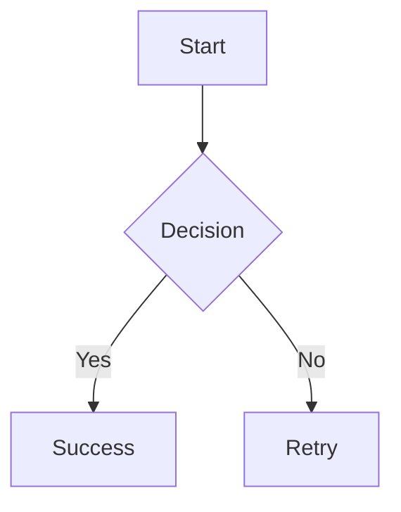

# mdr / mde

A cross-platform Markdown viewer (`mdr`) and editor (`mde`) built with Wails.

This application is largely the result of working with various AI (Gemini, Claude, GPT, Deepseek, and Qwen3-coder) and countless cycles of 'wait, not like that'. The architecture is mine, the code is mostly not, though I did have to jump in a few times and fix things. I wanted a simple application for rendering and editing Markdown on my Mac and my Asus Ascent GX10, so those are the platforms it's been tested on. I don't have a Windows box, which is why it isn't tested, but the AIs assure me it should build and work if someone wants to try it. I tried to make it fast and light.

## mdr - Markdown Viewer

`mdr` is a real-time Markdown viewer that reloads automatically when files change. It's perfect for viewing rendered Markdown alongside your favorite text editor. It's also great for quickly viewing any README.md file.

## mde - Markdown Editor

`mde` is a focused Markdown editor with syntax highlighting and live preview integration with `mdr`. Edit your Markdown with syntax coloring, then click Preview to see it rendered in `mdr`.

## Features

### mdr (Viewer)
- Open and render local Markdown files
- Table of Contents sidebar with pin/toggle
- Auto-reload for files and custom themes (works with atomic-save editors)
- Layout themes via user CSS files in `~/.config/mdr/mdthemes/`
- Palette override: `light` / `dark` / `theme`
- Font size controls with persistence
- Status bar for standardized info/errors
- **Keyboard shortcuts** for common operations
- **Mermaid diagram support** for flowcharts, sequence diagrams, and more
- **Edit button** to open current file in mde
- **Search functionality** with case-sensitive option

### mde (Editor)
- Syntax-highlighted Markdown editing with CodeMirror
- Multiple syntax themes: default, github, monokai, dracula, nord, solarized-dark, solarized-light, onedark
- Palette override: `light` / `dark`
- Font size controls with persistence
- **Word wrap toggle** with persistence
- **Preview button** to view rendered output in mdr
- Markdown formatting toolbar (headings, bold, italic, lists, links, etc.)
- Real-time character and cursor position display
- Automatic file association handling
- **Keyboard shortcuts** for common operations
- **Vim mode** option for Vim users

### Configuration

**mdr settings** are stored in `~/.config/mdr/mdr.conf`:
- `maxFileSizeMB` (default 5) guards against loading huge files
- `autoReload`, `tocVisible`, `tocPinned`, `palette`, `theme`, `fontScale`

**mde settings** are stored in `~/.config/mde/mde.conf`:
- `palette`, `theme`, `fontScale`, `wordWrap`, `vimMode`

## Mermaid Diagrams

mdr supports [Mermaid](https://mermaid.js.org/) diagrams out of the box. Simply use a fenced code block with the `mermaid` language identifier:

````markdown

````

Supported diagram types include:
- Flowcharts
- Sequence diagrams
- Class diagrams
- State diagrams
- Entity relationship diagrams
- User journey diagrams
- Gantt charts
- Pie charts
- And more!

See the [Mermaid documentation](https://mermaid.js.org/intro/) for syntax details.

## Keyboard Shortcuts

### mdr (Viewer)

#### File Operations
- **Open File**: `Ctrl+O` (Windows/Linux) / `Cmd+O` (Mac)
- **Reload File**: `Ctrl+R` (Windows/Linux) / `Cmd+R` (Mac)

#### View Controls
- **Toggle TOC**: `Ctrl+T` (Windows/Linux) / `Cmd+T` (Mac)
- **Pin/Unpin TOC**: `Ctrl+P` (Windows/Linux) / `Cmd+P` (Mac)
- **Reset Font Size**: `Ctrl+0` (Windows/Linux) / `Cmd+0` (Mac)
- **Increase Font Size**: `Ctrl+` (Windows/Linux) / `Cmd+` (Mac)
- **Decrease Font Size**: `Ctrl-` (Windows/Linux) / `Cmd-` (Mac)

#### Theme Controls
- **Cycle Palette**: `Ctrl+Shift+L` (Windows/Linux) / `Cmd+Shift+L` (Mac)
- **Cycle Theme**: `Ctrl+Shift+T` (Windows/Linux) / `Cmd+Shift+T` (Mac)

#### Search
- **Open Search**: `/` or `Ctrl+F` (Windows/Linux) / `Cmd+F` (Mac)
- **Next Match**: `F3`
- **Previous Match**: `Shift+F3`
- **Toggle Case Sensitive**: `Ctrl+Shift+F` (Windows/Linux) / `Cmd+Shift+F` (Mac)
- **Close Search**: `Esc`

#### Navigation
- **Close TOC**: `Esc` (when TOC is open)

### mde (Editor)

#### File Operations
- **Open File**: `Ctrl+O` (Windows/Linux) / `Cmd+O` (Mac)
- **Save File**: `Ctrl+S` (Windows/Linux) / `Cmd+S` (Mac)
- **Preview in mdr**: `Ctrl+P` (Windows/Linux) / `Cmd+P` (Mac)

#### Formatting
- **Bold**: `Ctrl+B` (Windows/Linux) / `Cmd+B` (Mac)
- **Italic**: `Ctrl+I` (Windows/Linux) / `Cmd+I` (Mac)
- **Insert Link**: `Ctrl+K` (Windows/Linux) / `Cmd+K` (Mac)
- **Code**: `Ctrl+`` (Windows/Linux) / `Cmd+`` (Mac)

#### Editor Options
- **Toggle Word Wrap**: `Ctrl+W` (Windows/Linux) / `Cmd+W` (Mac)

Security notes:

- Markdown is sanitized before rendering; the preview iframe is sandboxed with a strict CSP.  
- To deliberately allow raw, unsafe HTML (not recommended), set `MDR_UNSAFE_HTML=true` before launching.

## Development

- `wails dev`

## Building

Build both applications:
```bash
make mdr        # Build mdr viewer
make mde        # Build mde editor
make build      # Build both
```

## Installation

### MacOS

Run `make install` to build and install both applications:
```bash
make install    # Installs both mdr and mde
```

Or install individually:
```bash
make install-mdr    # Install mdr only
make install-mde    # Install mde only
```

- Apps installed to: `~/Applications/mdr.app` and `~/Applications/mde.app`
- Symlinks created: `~/bin/mdr` and `~/bin/mde`
- Themes installed to: `~/.config/mdr/mdthemes/`

### Linux

1. Build the application:
   ```bash
   make build
   ```
2. Install the binary (requires sudo):
   ```bash
   sudo make install
   ```
   *Installs `mdr` to `/usr/local/bin/`*

3. Install default themes (as normal user):
   ```bash
   make install_themes
   ```
   *Installs themes to `~/.config/mdr/mdthemes/`*

## Building & Packaging Notes

### Prerequisites (all platforms)

- **Go** (matching `go.mod`)
- **Node.js + npm** (for the frontend build)
- **Wails CLI v2**
  - Install: `go install github.com/wailsapp/wails/v2/cmd/wails@latest`

### macOS (primary)

- **WebView runtime**: Uses the system WebKit (built-in).
- **Tooling**:
  - Install Xcode Command Line Tools (`xcode-select --install`).

Build:

- `wails build`

Output:

- `build/bin/mdr.app` (and the embedded binary at `build/bin/mdr.app/Contents/MacOS/mdr`)

### Linux (primary)

- **WebView runtime**: Uses WebKitGTK.
- **Important**: Linux builds typically require **CGO** and the system GTK/WebKit dev libraries, so the most reliable path is to build **on Linux**.

Common dependencies (Debian/Ubuntu-style):

- `libgtk-3-dev`
- `libwebkit2gtk-4.0-dev` OR `libwebkit2gtk-4.1-dev`
- `pkg-config`

Build:

- `make build` (Recommended - handles WebKit version detection automatically)
- Or manually: `wails build -tags webkit2_41` (if using WebKit 4.1)

Output:

- `build/bin/mdr` (ELF binary)

### Windows (optional)

- **WebView runtime**: Microsoft Edge WebView2 runtime.
- **Tooling**:
  - MSVC build tools (Visual Studio Build Tools)
  - WebView2 runtime installed on target machines

Build:

- `wails build`

Output:

- Windows installer/assets are generated under `build/` depending on your Wails configuration.
