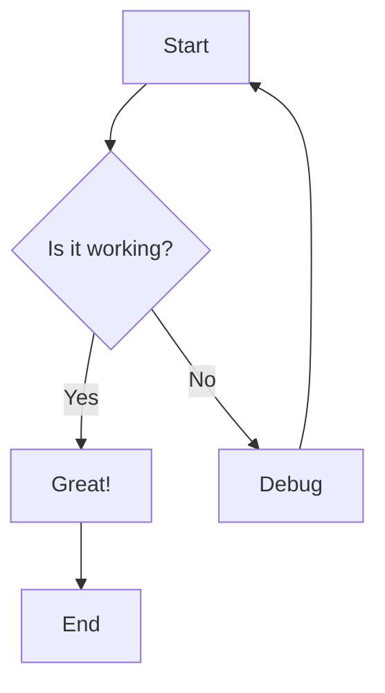
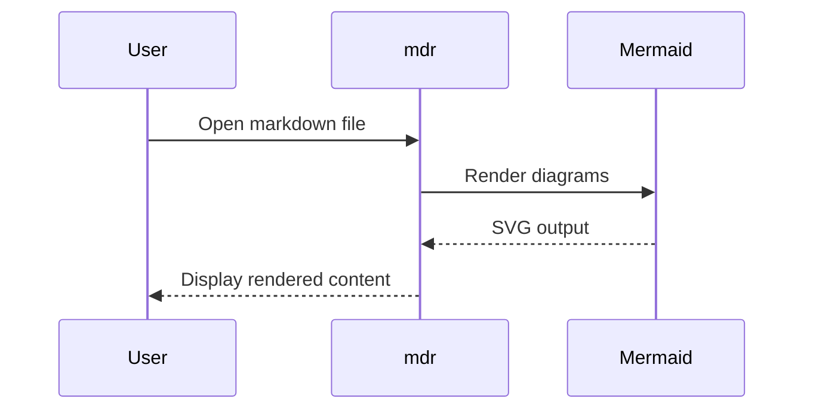
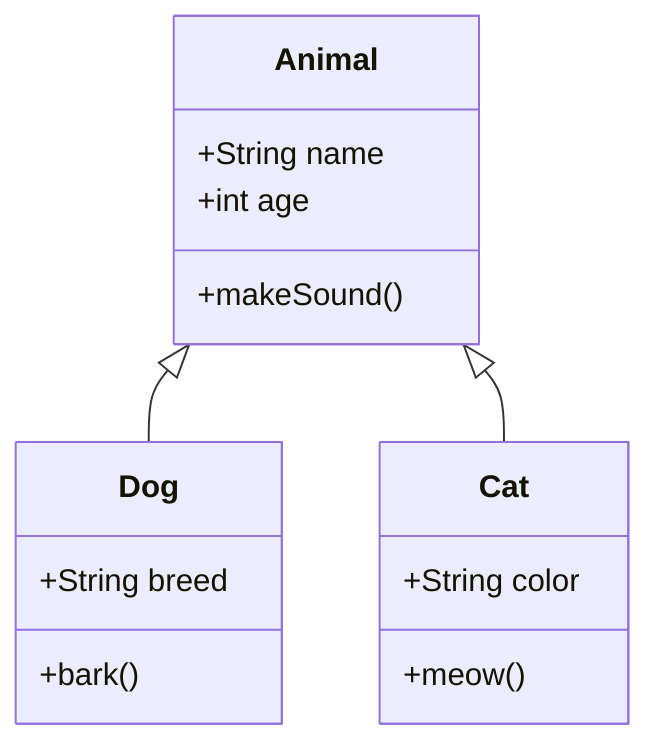
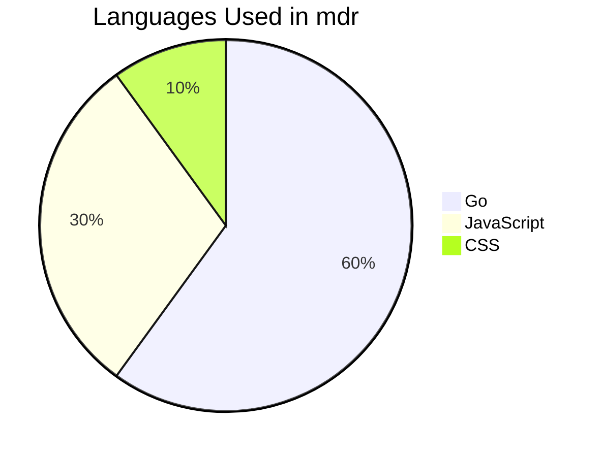

# Mermaid Test

This is a test file to verify Mermaid diagram rendering in mdr.

## Flowchart Example



## Sequence Diagram



## Class Diagram



## Regular Code Block (should not be rendered as Mermaid)

```javascript
console.log("This is just regular code");
```

## Pie Chart


